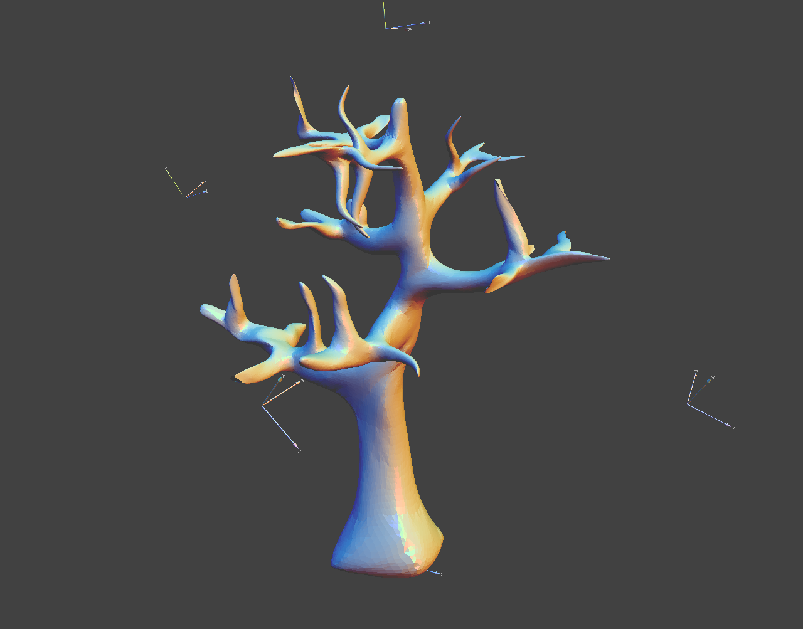
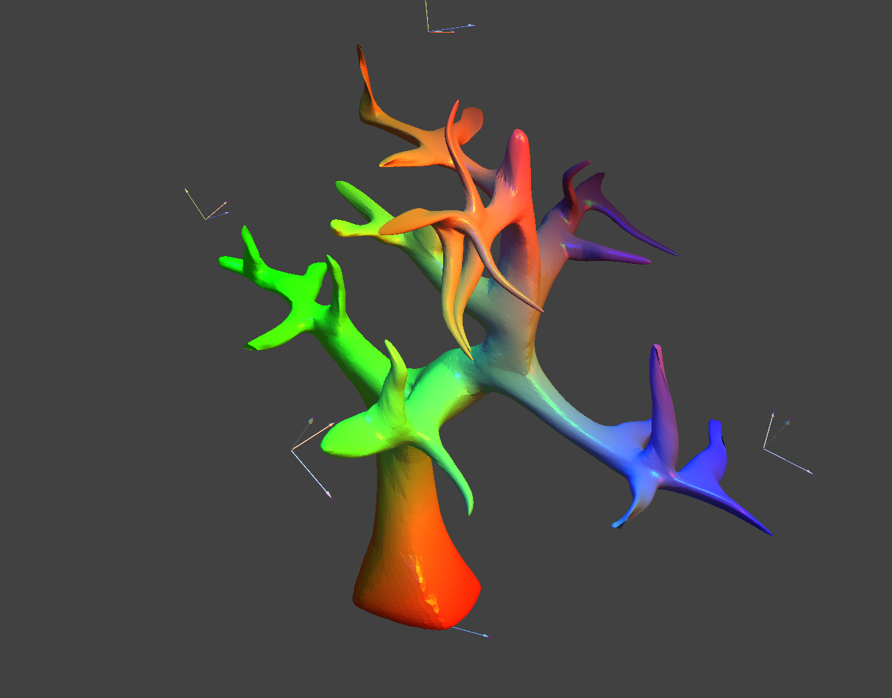

# skinning-subdivision-surfaces
Research application aiming to optimize in real time the deformations of control points
in order to obtain a smooth and intuitively animated subdivision surface.


## Installation
You need to install [QT](https://www.qt.io/) (>= 5.5).

You will also need an implementation of [OpenGL](https://www.opengl.org/) (>= 3.0)

Please also install [eigen3](https://eigen.tuxfamily.org/index.php?title=Main_Page)

Don't forget to build `libQGLViewer` in the extern directory.

Run `qmake` and then `make` to build the program.

Then use the following command to run our demonstrator:

```bash
./demonstrator
```

## Basic Usage

Press **h** to make the *help* window appear.

**Ctrl + mouse right button double click** to choose the background color.

Press **s** to subdivide the mesh with the Loop subdivision.

Press **r** to reset the mesh.

Press **c** to compute the constant matrixes to allow the transformation.

Press **m** to change the display mode,either *Target transformation* or *Optimized transformation*.

**Alt + mouse left button press** to add a new manipulated frame.

Press **d** to delete the selected manipulated frame.

To move a manipulated frame you only need to select it by hover your mouse over it, and then press the **left button** to turn the frame or press the **right button** to translate it.


## Images
### Original mesh after 4 subdivisions



### The optimized transformation applied on the previous mesh



### The target transformation

